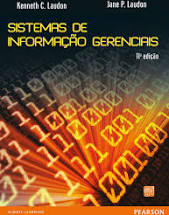

# Introdução ao Curso

------

## Boas vindas

Bem-vind@s ao curso de Fundamentos de Sistemas de Informação!

Curso:

- Pesquisa Operacional - `TCC00332` - C.H. 64
- Site: https://igormcoelho.github.io/curso-fundamentos-sistemas-informacao

Links úteis:

- http://www.ic.uff.br/index.php/pt/curriculo-e-disciplinas/disciplinas-obrigatorias
- https://app.uff.br/graduacao/quadrodehorarios
- https://app.uff.br/iduff
- Instituto de Computação (IC/UFF) - www.ic.uff.br
- Universidade Federal Fluminense (UFF) - www.uff.br

--------

## Sobre mim

::::::::::::: {.columns}

::::: {.column width=40%}

{width=50%}

e-mail (com prefixo no assunto 'FSI-2020.1'):

imcoelho at ic.uff.br (emergência)

:::::

::::: {.column width=60%}

Me chamo Igor, e é um prazer apresentar esse curso para vocês! Sou professor e pesquisador da UFF, desenvolvedor de algoritmos e sistemas (a maioria de código-aberto) e bastante ligado em novas tendências tecnológicas recentes, como Blockchain. Podem me contactar pelos emails ao lado (*substituam o 'at' por '@'*), mas peço que priorizem o uso da ferramenta de Classroom do curso, que consigo responder mais rápido e com contexto melhor (especialmente agora, com tudo virtual!)
Esse curso está disponível no meu site pessoal no github: https://igormcoelho.github.io/curso-fundamentos-sistemas-informacao

:::::

:::::::::::::

--------

## Sobre vocês

Gostaria que se apresentassem também (*nas aulas síncronas*) para nos conhecermos melhor!

Ninguém aprende 100% do que o professor ensina, e nem o professor consegue ensinar 100% de um conteúdo, então cabe aos alunos: *ler*, *estudar* e *questionar* (muito!). **Juntos** podemos trabalhar para transmitir esse conhecimento valioso para cada um de vocês.

Sempre que tiverem uma dúvida ou curiosidade, perguntem! Toda pergunta é valiosa, e o conhecimento é construído em pequenas porções.

-------

## Acordo Aluno-Professor

*Para esse curso funcionar: tenham dedicação!*

É fundamental:

- Não atrasar entrega de trabalho, mas caso precisem de uma extensão, solicitem antes do prazo! (*atrasos podem reduzir ou até zerar notas*)
- Buscar ao máximo não perder nenhuma aula (síncrona), e caso percam, busquem o quanto antes suprir esse conteúdo
- Nunca, em hipótese alguma, copiem um trabalho pronto! Além dos efeitos práticos (como perda de nota ou demais sanções previstas nas normas), não se enganem: quem mais perde é o aluno. Conhecimento é o bem mais valioso!
- **Sempre** citem as fontes, especialmente para trechos de textos. Sempre que possivel, indique a licença de uso de imagens e códigos (os buscadores permitem buscas com licença livre).

--------

## Período 2020.1 com aulas remotas

Atividades com aulas remotas em 2020.1

- Período: 14/09/2020 (segunda-feira) - 15/12/2020 (terça-feira)

- Lançamento de notas: 14/12/2020 (último encontro)

Teremos aulas síncronas em horários regulares e outras diversas atividades assíncronas complementares (vídeos, textos, trabalhos, ...) para suprir toda a carga horária.

Serão oferecidas aprox. 30% de aulas síncronas, além de atividades de apresentação/discussão síncronas.

Vide: *INSTRUÇÃO DE SERVIÇO PROGRAD Nº 15/2020, DE 25 DE AGOSTO DE 2020*

---------

## Horários Síncronos

Horários do curso: segunda e quarta 20h-22h.

Horários síncronos*: segundas 20h-22h (quartas sempre serão assíncronos)

(*) Algumas exceções estão previstas e algumas aulas poderão ser alteradas (caso seja necessário), mas esta é a regra geral.

---------

## Ementa

1. CONCEITOS BÁSICOS E ORGANIZAÇÃO DE SISTEMAS DE INFORMAÇÃO;
2. INFRAESTRUTURA DE TECNOLOGIA DE
INFORMAÇÃO;
3. COMÉRCIO ELETRÔNICO, GERÊNCIA DE CONHECIMENTO;
4. SISTEMAS DE APOIO À TOMADA DE
DECISÃO;
5. IMPACTOS SOCIAIS DA TECNOLOGIA DA INFORMAÇÃO.

--------

## Avaliação

Haverá atividades avaliativas assícronas (A), como listas de exercícios e resumos de textos/vídeos (R). Haverá apenas uma VS com conteúdo escrito (VS). Além disso, haverá atividades com apresentação (P) (*com formação opcional de grupos por tema de interesse*).

A nota N do curso será:

A = (30%R + 70%T)/2

N1 = (A + P)/2

De acordo com as normas regulares da UFF, a nota mínima N1 para aprovação é 6.

Caso contrário, será necessário fazer a VS.

N2 = (N1 + VS)/2

--------

## Cronograma (I)

- Período: 14/09/2020 - 15/12/2020

Tipo = Sinc./Asinc.

| Data       | Atividade                       | Tipo   |
| :---       |   :----                         | :---   |
| 14/09/2020 |  1-2 Introdução                 |  Sinc. |
| 16/09/2020 |  Leitura & Debates |  Asinc. |
| 21/09/2020 |  3-4-Infraestrutura-TI                   |  Sinc. |
| 23/09/2020 |  Leitura & Debates |  Asinc. |
| 28/09/2020 |  5-7-Nuvem-Decisão              |  Sinc. |
| 30/09/2020 |  Leitura & Debates |  Asinc. |
| 05/10/2020 |  8-10-Gestão-Estratégia         |  Sinc. |
| 07/10/2020 |  Leitura & Debates |  Asinc. |
| 12/10/2020 |  11-16-Introdução                     |  Sinc. |
| 14/10/2020 |  Leitura & Debates |  Asinc. |
| 19/10/2020 |  19-21-Software Livre & Projetos |  Sinc. |

------

## Cronograma (II)

| Data       | Atividade                       | Tipo   |
| :---       |   :----                         | :---   |
| 21/10/2020 |  Entrega (T)                 |  Asinc. |
| 26/10/2020 |  Revisão Conteúdo               |  Sinc. |
| 28/10/2020 |  Leitura & Debates              |  Asinc. |
| 02/11/2020 |  Debates *                      |  *Asinc. |
| 04/11/2020 |  Debates *                      |  Asinc. |
| 09/11/2020 |  Apresentação (P)               |  Sinc. |
| 11/11/2020 |  Debates (P)                    |  Asinc. |
| 16/11/2020 |  Apresentação (P)               |  Sinc. |
| 18/11/2020 |  Debates (P)                    |  Asinc. |
| 23/11/2020 |  Apresentação (P)               |  Sinc. |
| 24/11/2020 |  Debates (P)                    |  Asinc. |
| 30/11/2020 |  Apresentação (P)               |  Sinc. |
| 02/12/2020 |  Debates (P)                    |  Asinc. |

-------

## Cronograma (III)

| Data       | Atividade                       | Tipo   |
| :---       |   :----                         | :---   |
| 07/12/2020 |  Segunda Chamada                |  Sinc. |
| 09/12/2020 |  -                  |  Asinc. |
| 14/12/2020 |  VS                            |  *Asinc. |
| 15/12/2020 |  Lançamento Notas              |  *Asinc. |

-------

## Trabalho (T)

O trabalho consiste em analisar uma empresa (vide aulas 01-03) e deverá ser feito em formato artigo com no mínimo 3 membros (casos excepcionais serão analisados apenas caso não seja possível formar grupos).

A formação de grupos será pela plataforma, durante debates cada aluno irá indicar uma empresa de interesse (em um primeiro momento). Assim, serão agregados naturalmente grupos (por ordem cronológica de criação de grupos completos) com no máximo duas repetições por tema.

O formato será da SBC (word ou LaTeX PDF).

-------

## Apresentação (P)

A apresentação seguirá a mesma lógica de (T), com grupos formados pela plataforma, por temas de interesse.

Os temas serão debatidos ao longo das aulas, e definidos no máximo até a data (T). Haverá quatro dias possíveis para apresentação, mais um debate assíncrono das apresentações do dia.

**É necessário agendar previamente a apresentação! Façam o quanto antes!**

A lista de tópicos será disponibilizada durante as primeiras aulas (tópicos inovadores de tecnologia da informação e novos modelos de negócio).

-------

## Bibliografia Recomendada

::::::::::::: {.columns}

::::: {.column width=40%}

{width=50%}

:::::

::::: {.column width=60%}

Buscaremos suprir o conteúdo especialmente através de materiais com licença livre (slides, apostilas, vídeos, textos, ...). Como livro texto, recomendamos o livro: *"Laudon & Laudon. Sistemas de Informação Gerenciais"*.
Veja Classroom para mais materiais.

:::::

:::::::::::::

# Agradecimentos

-----

## Pessoas

Em especial, agradeço ao prof. Marcelo Fornazin, cujos materiais e dicas foram o cerne desses slides.

Sem essa valiosa contribuição, esse curso não seria possível!

Estendo os agradecimentos aos demais colegas que colaboraram com a elaboração do material do curso de [Pesquisa Operacional](https://github.com/igormcoelho/curso-pesquisa-operacional-i), que abriu caminho para verificação prática dessa tecnologia de slides.

-----

## Software

Esse material de curso só é possível graças aos inúmeros projetos de código-aberto que são necessários a ele, incluindo:

- pandoc
- LaTeX
- GNU/Linux
- git
- markdown-preview-enhanced (github)
- visual studio code
- atom
- revealjs
- ...

-----

## Empresas

Agradecimento especial a empresas que suportam projetos livres envolvidos nesse curso:

- github
- gitlab
- microsoft
- google
- ...

-----

## Reprodução do material

Esses slides foram escritos utilizando pandoc, segundo o tutorial ilectures:

- https://igormcoelho.github.io/ilectures-pandoc/

Exceto expressamente mencionado (e com as devidas ressalvas ao material cedido pelo prof. Fornazin), a licença será Creative Commons.

**Licença:** CC-BY 4.0 2020

Igor Machado Coelho
